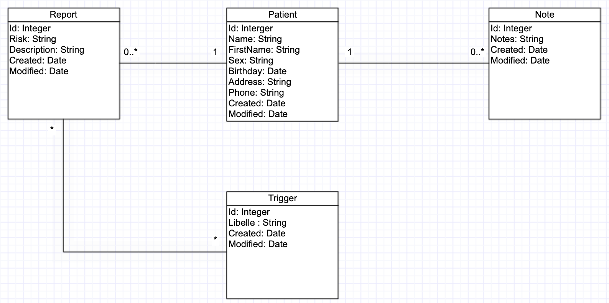
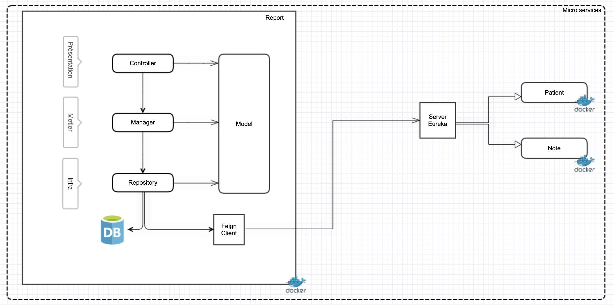

# Mediscreen

Mediscreen est un outil pour aider des médecins à identifier les patients les
                              plus à risques
# Diagramme de classe

# Architecture

## Getting Started

Comment lancer le projet?

### Prerequisites

- Java 1.8
- Maven 3.6.1
- Mysql 8.0.19
- MongoDB 4.2.0
- Nodejs 14.8.0

### Installing

1. installez Java:

https://docs.oracle.com/javase/8/docs/technotes/guides/install/install_overview.html

2. installez Maven:

https://maven.apache.org/install.html

3. installez Mysql:

https://dev.mysql.com/downloads/mysql/

4. installez MongoDB:

https://docs.mongodb.com/manual/installation/

5. installez Nodejs:

https://nodejs.org/en/``

### Running App
Après l'installation de MySQL,MongoDB, Java et Maven, vous devrez configurer les tables et les données dans la base de données. 
Pour cela veuillez créer les différentes bases de données en vous référant au fichier application.properties de chaque service
- Note -> note/src/main/resources/application.properties
- Patient -> patient/src/main/resources/application.properties
- Rapport -> rapport/src/main/resources/application.properties

Vous pouvez importer le code dans un IDE de votre choix et exécuter :
- NoteApplication pour lancer le service Note
- PatientApplication pour lancer le service Patient
- RapportApplication pour lancer le service Rapport

Pour lancer le UI en React, veuillez vous placer dans le répertoire mediscreen-react-ui et exécuter :
- npm install ou yarn
- npm start 

### Testing

Pour exécuter les tests à partir de maven, accédez au dossier contenant le fichier pom.xml de chaque service et exécutez la commande ci-dessous.

mvn test

### The final Jar file

- mvn package jar tf target/note.jar
- mvn package jar tf target/patient.jar
- mvn package jar tf target/rapport.jar

